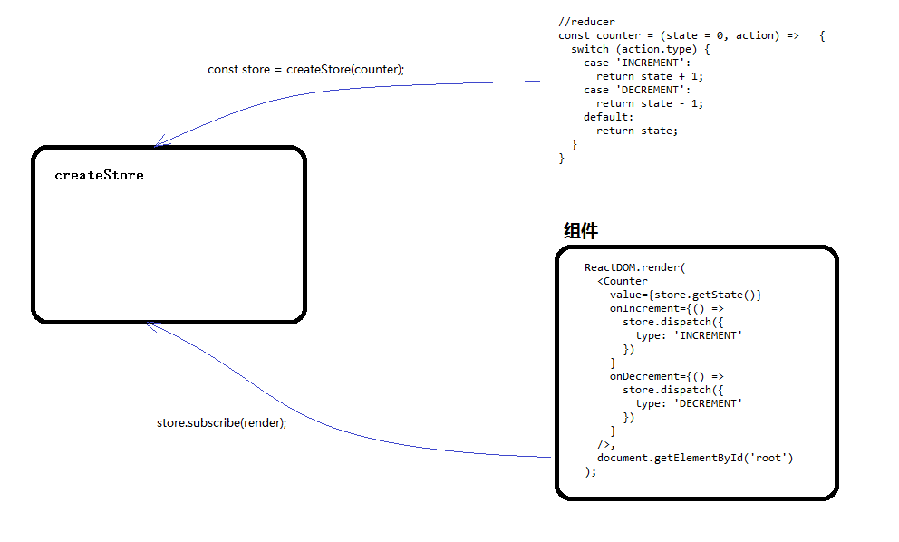

> npm install react react-dom --save

 

> npm install babel-preset-react --save

 

> 更新webpack.config.js

 

	module.exports = {
	    entry: './main.js',
	    output: {
	        path: './',
	        filename: 'index.js'
	    },
	    module: {
	        loaders: [
	            {
	                test: /\.js$/,
	                exclude: /node_modules/,
	                loader: 'babel',
	                query: {
	                    presets: ['es2015', 'react']
	                }
	            }
	        ]
	    }
	}

 

> 更新index.html

 

	<!doctype html>
	<html>
	<head>
	    <meta charset="UTF-8">
	    <title>Untitled Document</title>
	</head>
	<body>
	
	

	
	</body>
	</html>

 

**在上一节中，大致了解了`createStore`的工作原理： `getState`用来获取状态，subscribe用来注册事件(把页面属性和状态绑定起来)，dispatch用来触发reducer方法和注册事件。**

 

> main.js

 
	
	import { createStore } from 'redux';
	import React from 'react';
	import ReactDOM from 'react-dom';
	
	
	//reducer
	const counter = (state = 0, action) => {
	  switch (action.type) {
	    case 'INCREMENT':
	      return state + 1;
	    case 'DECREMENT':
	      return state - 1;
	    default:
	      return state;
	  }
	} 
	
	const Counter = ({
	  value,
	  onIncrement,
	  onDecrement
	}) => (
	  

	    <h1>{value}</h1>
	    <button onClick={onIncrement}>+</button>
	    <button onClick={onDecrement}>-</button>
	  

	);
	
	const store = createStore(counter);
	
	const render = () => {
	  ReactDOM.render(
	    <Counter
	      value={store.getState()}
	      onIncrement={() =>
	        store.dispatch({
	          type: 'INCREMENT'           
	        })            
	      }
	      onDecrement={() =>
	        store.dispatch({
	          type: 'DECREMENT'           
	        })            
	      }
	    />,
	    document.getElementById('root')
	  );
	};
	
	store.subscribe(render);
	render();

以上，工作过程大致是这样的：

 

1. counter函数，对于`createStore`来说就是reducer,用来维护状态，先声明
2. 接着，把counter函数赋值给了`createStore`
3. Counter就是React组件，就像一个模板，你给我什么，我就显示什么
4. render方法就是注册事件，把状态和组件属性映射起来
5. 通过`subscribe`方法注册事件
6. 当页面首次加载，调用render方法渲染出组件
7. 当点击+或-就触发`createStore`的`dispatch`方法，其内部不仅执行了reducer方法，还把注册事件执行一遍，组件又得以重新加载

 

**总结：**

 

- `createStore`需要reducer, reducer用来维护状态
- React组件的渲染就是一个事件，通过subscribe方法告诉`createStore`
- React组件的初次渲染会调用getState方法获取状态
- React组件的事件，比如这里的click事件，其实是在`createStore`内部调用了dispatch方法, dispatch方法不仅调用reducer方法维护状态，还触发`createStore`的绑定事件，让组件得以重新加载

 