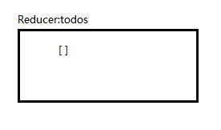
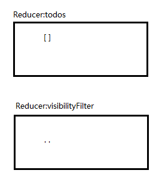
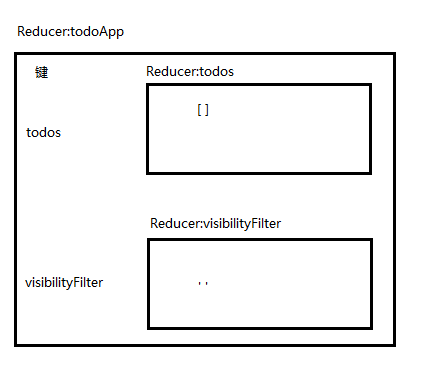
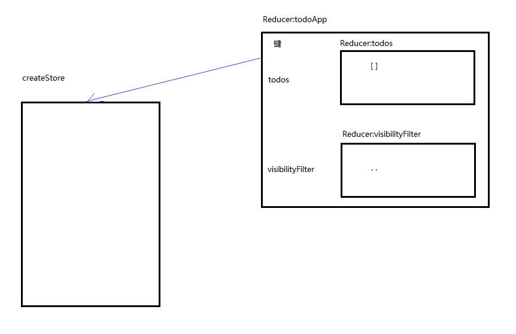

 

本篇实践的是添加Todo.

 

> main.js

 

	import { createStore, combineReducers } from 'redux';
	import React, { Component } from 'react';
	import ReactDOM from 'react-dom';
	
	//Reducer列表项，被Reducer列表引用
	//这里的state是列表项，是一个对象
	const todo = (state, action) => {
	  switch (action.type) {
	    case 'ADD_TODO':
	      return {
	        id: action.id,
	        text: action.text,
	        completed: false
	      };
	    case 'TOGGLE_TODO':
	      if (state.id !== action.id) {
	        return state;
	      }
	
	      return {
	        ...state,
	        completed: !state.completed
	      };
	    default:
	      return state;
	  }
	};
	
	//Reducer列表
	//这里的state是对象数组
	const todos = (state = [], action) => {
	  switch (action.type) {
	    case 'ADD_TODO':
	      return [
	        ...state,
	        todo(undefined, action)
	      ];
	    case 'TOGGLE_TODO':
	      return state.map(t => todo(t, action));
	    default:
	      return state;
	  }
	};
	
	//Reducer,显示所有和显示已完成之间切换
	//这里的state是字符串
	const visibilityFilter = (
	  state = 'SHOW_ALL',
	  action
	) => {
	  switch (action.type) {
	    case 'SET_VISIBILITY_FILTER':
	      return action.filter;
	    default:
	      return state;
	  }
	};
	
	
	//合并成一个Reducer,使用combineReducers
	const todoApp = combineReducers({
	   todos: todos,
	    visibilityFilter: visibilityFilter
	});
	
	const store = createStore(todoApp);
	
	let nextTodoId = 0;
	class TodoApp extends Component{
	    render(){
	        return (
	            

	                <input ref={node => {this.input = node;}} />
	                <button onClick={() => {
	                    store.dispatch({
	                        type: 'ADD_TODO',
	                        text: this.input.value,
	                        id: nextTodoId++
	                    });
	            
	                    this.input.value = '';
	                }}>Add Todo</button>
	                <ul>
	                    {this.props.todos.map(todo => 
	                        <li key={todo.id}>{todo.text}</li>
	                     )}
	                </ul>
	            

	        )
	    }
	}
	
	const render = () => {
	    ReactDOM.render(
	        <TodoApp todos={store.getState().todos} />,
	        document.getElementById('root')
	    );
	};
	
	store.subscribe(render);
	render();

 

首先是一个名称是todos的Reducer:

然后是一个名称是visibilityFilter的Reducer

接着，又通过`combineReducers`合并成一个Reducer

`createStore`开始接手名称为todoApp的这个Reducer: `const store = createStore(todoApp);`

然后定义了一个React的组件，名称是TodoApp。

并且TodoApp组件的渲染过程封装到render方法中。

 

**组件TodoApp的渲染过程如何与createStore建立联系呢？**

 

需要通过`store.subscribe(render)`方法。

 

**最后：**

 

- 当第一次加载页面的时候，调用render方法把组件渲染出来
- 当点击添加按钮，就调用`store.dispatch`方法，首先使用Reducer更改状态，然后再次调用createStore注册的事件，重新渲染组件

 

