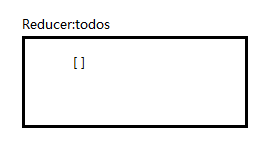
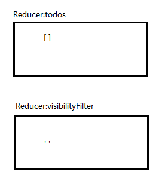
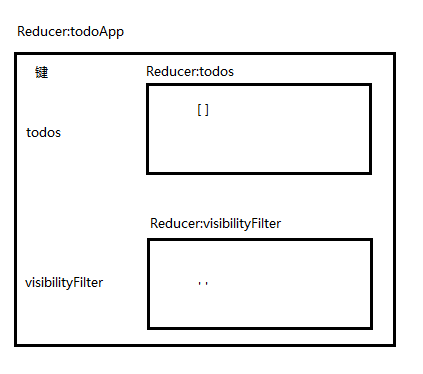
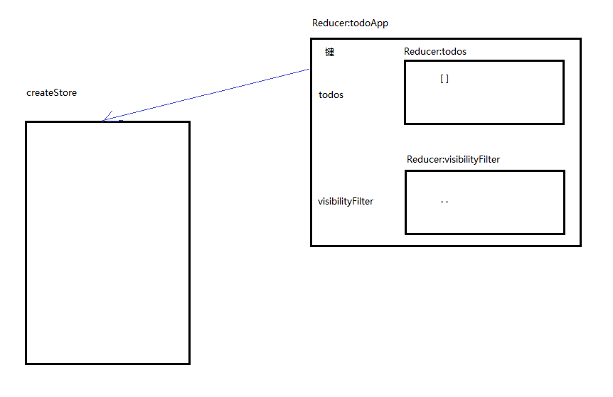

 

本篇体验设置过滤条件。在Todo的列表下面有三个链接：

 

1. 点击All,显示所有未完成和已完成
2. 点击Active,显示未完成
3. 点击Completed,显示已完成

 

首先是名称为todos的reducer,维护着一个数组状态，代码如下：

	const todo = (state, action) => {
	  switch (action.type) {
	    case 'ADD_TODO':
	      return {
	        id: action.id,
	        text: action.text,
	        completed: false
	      };
	    case 'TOGGLE_TODO':
	      if (state.id !== action.id) {
	        return state;
	      }
	
	      return {
	        ...state,
	        completed: !state.completed
	      };
	    default:
	      return state;
	  }
	};
	
	const todos = (state = [], action) => {
	  switch (action.type) {
	    case 'ADD_TODO':
	      return [
	        ...state,
	        todo(undefined, action)
	      ];
	    case 'TOGGLE_TODO':
	      return state.map(t =>
	        todo(t, action)
	      );
	    default:
	      return state;
	  }
	};

 

达到的效果大致如下：

接着，名称为visibilityFilter的Reducer，维护着一个字符串状态，其实就是过滤条件。代码如下：

	const visibilityFilter = (
	  state = 'SHOW_ALL',
	  action
	) => {
	  switch (action.type) {
	    case 'SET_VISIBILITY_FILTER':
	      return action.filter;
	    default:
	      return state;
	  }
	};

达到的效果大致如下：

然后，就需要把以上的2个Reducer合并到一个Reducer中，代码如下：

	const todoApp = combineReducers({
	  todos,
	  visibilityFilter
	});

 

合并后的Reducer达到了这样的效果：

现在，需要把Reducer交给createStore了。代码如下：

	const store = createStore(todoApp);

 

达到了如下的效果：

All, Active, Completed这三个筛选条件，也需要创建一个组件，比如叫FilterLink。这个组件需要3个变量：第一个变量是接受当前的过滤条件，类似`<FilterLink filter='SHOW_ALL'></FilterLink>`;第二个变量是接受当前Reducer中的过滤状态，类似`<FilterLink filter='SHOW_ALL' currentFilter='SHOW_ALL'></FilterLink>`;第三个变量用于接受`<FilterLink filter='SHOW_ALL' currentFilter='SHOW_ALL'></FilterLink>`之间的内容，默认是放到`props.children`中的。代码如下：

	const FilterLink = ({
	  filter,
	  currentFilter,
	  children
	}) => {
	  if (filter === currentFilter) {
	    return {children};
	  }
	
	  return (
	    <a href='#'
	       onClick={e => {
	         e.preventDefault();
	         store.dispatch({
	           type: 'SET_VISIBILITY_FILTER',
	           filter
	         });
	       }}
	    >
	      {children}
	    </a>
	  );
	};

其实，这个FilterLink组件，将被用来作为TodoApp的内嵌组件。

 

接下来就是TodoApp这个组件了，它需要知道todoApp这个Reducer中，todos这个reducer中的状态和visibilityFilter这个Reducer的状态。基本上是先根据条件过滤，然后渲染html。代码如下：

	const getVisibleTodos = (
	  todos,
	  filter
	) => {
	  switch (filter) {
	    case 'SHOW_ALL':
	      return todos;
	    case 'SHOW_COMPLETED':
	      return todos.filter(
	        t => t.completed
	      );
	    case 'SHOW_ACTIVE':
	      return todos.filter(
	        t => !t.completed
	      );
	  }
	}
	
	let nextTodoId = 0;
	class TodoApp extends Component {
	  render() {
	    const {
	      todos,
	      visibilityFilter
	    } = this.props;
	    const visibleTodos = getVisibleTodos(
	      todos,
	      visibilityFilter
	    );
	    return (
	      

	        <input ref={node => {
	          this.input = node;
	        }} />
	        <button onClick={() => {
	          store.dispatch({
	            type: 'ADD_TODO',
	            text: this.input.value,
	            id: nextTodoId++
	          });
	          this.input.value = '';
	        }}>
	          Add Todo
	        </button>
	        <ul>
	          {visibleTodos.map(todo =>
	            <li key={todo.id}
	                onClick={() => {
	                  store.dispatch({
	                    type: 'TOGGLE_TODO',
	                    id: todo.id
	                  });         
	                }}
	                style={{
	                  textDecoration:
	                    todo.completed ?
	                      'line-through' :
	                      'none'
	                }}>
	              {todo.text}
	            </li>
	          )}
	        </ul>
	        

	          Show:
	          {' '}
	          <FilterLink
	            filter='SHOW_ALL'
	            currentFilter={visibilityFilter}
	          >
	            All
	          </FilterLink>
	          {', '}
	          <FilterLink
	            filter='SHOW_ACTIVE'
	            currentFilter={visibilityFilter}
	          >
	            Active
	          </FilterLink>
	          {', '}
	          <FilterLink
	            filter='SHOW_COMPLETED'
	            currentFilter={visibilityFilter}
	          >
	            Completed
	          </FilterLink>
	        

	      

	    );
	  }
	}

以上，FilterLink组件已经内嵌到TodoApp这个组件中了，FilterLink组件的props.currentFilter属性值来自于TodoApp的props.visibilityFilter,而TodoApp的props.visibilityFilter来自于Reducer维护的状态。

 

	const render = () => {
	  ReactDOM.render(
	    <TodoApp
	      {...store.getState()}
	    />,
	    document.getElementById('root')
	  );
	};

 

> main.js,完整如下：

 

	import { createStore, combineReducers } from 'redux';
	import React, { Component } from 'react';
	import ReactDOM from 'react-dom';
	
	const todo = (state, action) => {
	  switch (action.type) {
	    case 'ADD_TODO':
	      return {
	        id: action.id,
	        text: action.text,
	        completed: false
	      };
	    case 'TOGGLE_TODO':
	      if (state.id !== action.id) {
	        return state;
	      }
	
	      return {
	        ...state,
	        completed: !state.completed
	      };
	    default:
	      return state;
	  }
	};
	
	const todos = (state = [], action) => {
	  switch (action.type) {
	    case 'ADD_TODO':
	      return [
	        ...state,
	        todo(undefined, action)
	      ];
	    case 'TOGGLE_TODO':
	      return state.map(t =>
	        todo(t, action)
	      );
	    default:
	      return state;
	  }
	};
	
	const visibilityFilter = (
	  state = 'SHOW_ALL',
	  action
	) => {
	  switch (action.type) {
	    case 'SET_VISIBILITY_FILTER':
	      return action.filter;
	    default:
	      return state;
	  }
	};
	
	
	const todoApp = combineReducers({
	  todos,
	  visibilityFilter
	});
	
	const store = createStore(todoApp);
	
	
	const FilterLink = ({
	  filter,
	  currentFilter,
	  children
	}) => {
	  if (filter === currentFilter) {
	    return {children};
	  }
	
	  return (
	    <a href='#'
	       onClick={e => {
	         e.preventDefault();
	         store.dispatch({
	           type: 'SET_VISIBILITY_FILTER',
	           filter
	         });
	       }}
	    >
	      {children}
	    </a>
	  );
	};
	
	const getVisibleTodos = (
	  todos,
	  filter
	) => {
	  switch (filter) {
	    case 'SHOW_ALL':
	      return todos;
	    case 'SHOW_COMPLETED':
	      return todos.filter(
	        t => t.completed
	      );
	    case 'SHOW_ACTIVE':
	      return todos.filter(
	        t => !t.completed
	      );
	  }
	}
	
	let nextTodoId = 0;
	class TodoApp extends Component {
	  render() {
	    const {
	      todos,
	      visibilityFilter
	    } = this.props;
	    const visibleTodos = getVisibleTodos(
	      todos,
	      visibilityFilter
	    );
	    return (
	      

	        <input ref={node => {
	          this.input = node;
	        }} />
	        <button onClick={() => {
	          store.dispatch({
	            type: 'ADD_TODO',
	            text: this.input.value,
	            id: nextTodoId++
	          });
	          this.input.value = '';
	        }}>
	          Add Todo
	        </button>
	        <ul>
	          {visibleTodos.map(todo =>
	            <li key={todo.id}
	                onClick={() => {
	                  store.dispatch({
	                    type: 'TOGGLE_TODO',
	                    id: todo.id
	                  });         
	                }}
	                style={{
	                  textDecoration:
	                    todo.completed ?
	                      'line-through' :
	                      'none'
	                }}>
	              {todo.text}
	            </li>
	          )}
	        </ul>
	        

	          Show:
	          {' '}
	          <FilterLink
	            filter='SHOW_ALL'
	            currentFilter={visibilityFilter}
	          >
	            All
	          </FilterLink>
	          {', '}
	          <FilterLink
	            filter='SHOW_ACTIVE'
	            currentFilter={visibilityFilter}
	          >
	            Active
	          </FilterLink>
	          {', '}
	          <FilterLink
	            filter='SHOW_COMPLETED'
	            currentFilter={visibilityFilter}
	          >
	            Completed
	          </FilterLink>
	        

	      

	    );
	  }
	}
	
	const render = () => {
	  ReactDOM.render(
	    <TodoApp
	      {...store.getState()}
	    />,
	    document.getElementById('root')
	  );
	};
	
	store.subscribe(render);
	render();

 

